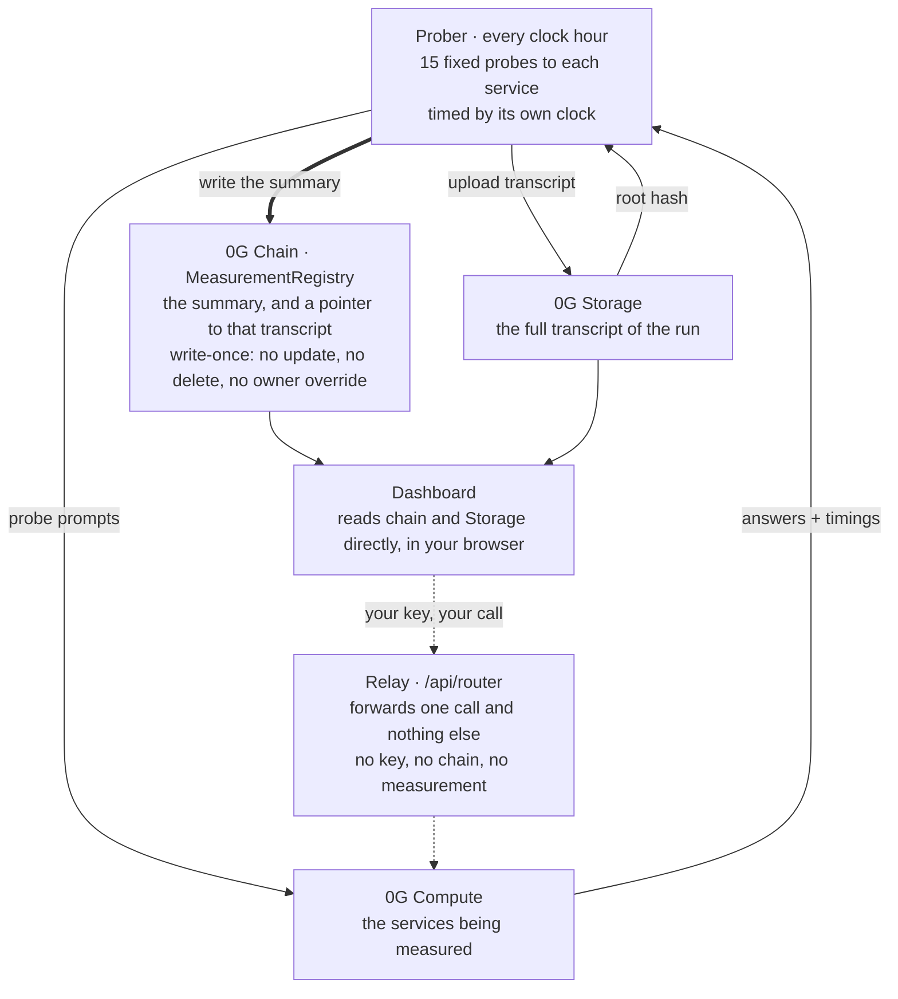

# 0G Provider Observatory

An independent measurement layer for 0G's inference network.

It measures providers from the outside, writes what it found to a write-once ledger on 0G
mainnet, and puts the raw transcript on 0G Storage — so anyone can recheck the numbers, or
take their own measurement and compare.

It reports divergence. It does not attribute motive.

**[og-provider-observatory.vercel.app](https://og-provider-observatory.vercel.app)** — the
dashboard, reading 0G mainnet in your browser. No account, no wallet, nothing served from a
database of ours.

## 60-second demo

1. Open the dashboard and choose **Pick**.
2. Select a model, set the latency/error/divergence limits your app can tolerate, and copy
   the Router call with `X-0G-Provider-Address` already filled in.
3. Open **Verify** or **Reproducibility** to see the on-chain record and 0G Storage evidence
   behind the recommendation.

---

## The problem

0G's network exposes dozens of inference services. Several providers serve the same model,
at different speeds, with different guarantees.

Today a developer picks between them using figures the network reports about itself. Nobody
has measured those figures independently, and none of them are kept over time — so there is
no way to ask "how did this provider behave last week", and no way to check whether two
providers claiming the same model actually answer alike.

This project measures that, and publishes the evidence alongside the result.

Measuring has already turned up one thing worth stating plainly. The `verifiability` field
returned by the network's own service registry reads `TeeML` for 21 of 23 services, but only
6 run the model inside the enclave — the distinction lives in a different field,
`TargetSeparated`, inside the metadata blob. A developer following the documented path reads
a stronger guarantee than 15 of those services provide. That is a measurement, not an accusation, and it is written
up with the method in [`docs/network-findings.md`](docs/network-findings.md) §3.

## How it works



The solid arrows are the instrument: it runs from a clone or a schedule, and nothing of ours
sits between the prober and the services it measures. The dotted arrows are optional and exist
only on the dashboard's Measure panel, where a reader takes their own measurement with their
own key — the relay is there because the network's Router will not answer a browser page it
does not recognise. It is 83 lines and holds no secret; §3 below says what it can and cannot
see.

What each epoch records, per service:

| | |
|---|---|
| **p50 / p95** | response time, measured by the prober's own clock |
| **error rate** | calls that failed in a way attributed to the provider |
| **divergence** | how often this service's answers differed from other providers of the same model |

An **epoch** is one measurement run. One per clock hour.

### Which 0G components this uses, and how

| Component | Where in this repo | How it is used |
|---|---|---|
| **0G Chain** — mainnet, chain 16661 | `contracts/`, `src/chain/` | Two contracts. `ProviderRegistry` names the 38 provider/model pairs being measured; `MeasurementRegistry` is the write-once ledger — one transaction per epoch, no update, no delete, no owner override. Both source-verified on ChainScan. |
| **0G Storage** | `src/storage/`, `src/verify/` | The full transcript of every run. The merkle root is computed locally *before* the upload and checked against what the indexer reports, then written into the on-chain record. A verifier refetches the evidence through the public gateway with `curl` alone — no SDK, no wallet, no key. |
| **0G Compute** | `src/probes/` | The subject of the measurement. 15 fixed probes per service, sent through the 0G Router with the provider pinned by `X-0G-Provider-Address` and a price ceiling attached per call, so a run measures the service it means to measure and cannot overspend. |

Not used: 0G DA, Agentic ID, 0G Pay. Nothing here needs them, and claiming a component this
project does not exercise would be the first unverifiable line in it.

### Live on 0G Aristotle mainnet — chain 16661

```
ProviderRegistry      0x25165feDACd1B78e103c3B49FcAF7CAeB118b9D6
MeasurementRegistry   0xF2fC195A72Ed74e09530b31C568c1e0CBF6c0333
prober                0x691Bb0Cc823A03f7dcaF272Dc62896668f81D2FD
```

Both contracts are source-verified on the explorer, `exactMatch` — the deployed bytecode and
the code in `contracts/` are the same thing, and the ABI is public:
[ProviderRegistry](https://chainscan.0g.ai/address/0x25165feDACd1B78e103c3B49FcAF7CAeB118b9D6)
· [MeasurementRegistry](https://chainscan.0g.ai/address/0xF2fC195A72Ed74e09530b31C568c1e0CBF6c0333)
· [prober](https://chainscan.0g.ai/address/0x691Bb0Cc823A03f7dcaF272Dc62896668f81D2FD).

38 provider/model pairs registered. Published so far:

| Epoch | Written (UTC) | Services | Calls | Transaction |
|---|---|---|---|---|
| 496539 | 2026-08-24 03:31 | 10 | 146 | [`0xf3f1de65…`](https://chainscan.0g.ai/tx/0xf3f1de65f0b25652ea0e88cde51d2cc3ee879e574609863b12b97fcb53ca83b2) |
| 496540 | 2026-08-24 04:10 | 10 | 145 | [`0xec8f6a1e…`](https://chainscan.0g.ai/tx/0xec8f6a1e456d3194b9476c7f8e04e3bfcb5f0c2750d19de6f0c8f7cb1e3676a1) |
| 496591 | 2026-08-26 07:18 | 10 | 149 | [`0x73d3f088…`](https://chainscan.0g.ai/tx/0x73d3f088264e408f582031cb22da523e1bfecdcc207c86d1d0205a4963f85d79) |
| 496592 | 2026-08-26 08:34 | 10 | 149 | [`0x0958e353…`](https://chainscan.0g.ai/tx/0x0958e353c1731dd295062bdd96c6ec5d8e3f18d720a6ac57be1d421522720208) |
| 496609 | 2026-08-27 01:41 | 10 | 149 | [`0xc4ccf300…`](https://chainscan.0g.ai/tx/0xc4ccf300bc36e6159bc38124b4b3c45687fd4025aeebd216ddd73ca461ec5079) |
| 496610 | 2026-08-27 02:47 | 10 | 149 | [`0x3057cd97…`](https://chainscan.0g.ai/tx/0x3057cd97da4af2915bc313fa1d16d713a248c22cf5cf151be70d0b466d84b2bd) |

`Calls` is the number of samples the published figures rest on, summed over the ten services
— the same `calls` field each on-chain measurement carries. Every epoch sent 150.
The prober's full history is `epochsOf(0x691Bb0Cc…)` on `MeasurementRegistry`; this table
is that list, not a selection from it.

## Check it yourself

Three checks, each doubting the one before it. Pick how far you want to go.

### 1. Does the number follow from the evidence?

```bash
pnpm install
pnpm verify 496609
```

No wallet, no API key, no cost. It reads the chain record, fetches the evidence its
`storageRoot` points at, rehashes the bytes, and recomputes every published figure using the
rules the bundle itself states.

`src/verify/` imports nothing from `src/probes/`. A verifier that called the measurement code
would agree with it even if the formula were wrong — it would catch tampering and nothing
else.

### 2. Does the instrument give the same answer twice?

```bash
pnpm reproduce data/epochs/496609-2026-08-27T013715480Z.bundle.json 496592
```

Also free. Two runs at two different times see different load, so latency is reported as a
**ratio and never scored**. What is stable enough to compare is the conclusion: observed
mode, whether divergence was measurable, whether the service diverges at all, and error rate
past 1000 bps.

Neither run is treated as correct. Where they disagree, the tool names the disagreement and
stops there.

That example does disagree, which is the point of running it rather than a cleaner pair: two
mainnet epochs a day apart agree on all ten services' observed modes and error rates, and
differ on whether one model diverged from its peers.

### 3. Do you get the same result?

Take your own measurement with your own Router key and compare it against a published epoch.
Two ways:

**From the dashboard**, on the Measure panel — pick a group, paste a key with `inference`
scope, and the panel prices the run before you start it: the tokens the published epoch
actually spent on that group, at the rates advertised right now. The probes come from that
epoch's evidence, not from this repository. No clone, no flags. On epoch 496609 the cheapest
group prices at **$0.0009** and the dearest at **$0.043**, but read the figure from the panel
rather than from here — advertised rates move, and a number written down in a README does
not.

> **This path asks one thing of you.** Your key passes through a small server of ours at
> `/api/router` on its way to 0G's Router. It has to: the Router will not answer a browser
> page it does not recognise.
>
> That server forwards one call and nothing else. It holds no key of its own, never reads the
> chain, and does no measuring — so it cannot change a number. What it *can* do is see your
> key go past, which is why it logs no header and no body. It is 83 lines, and reading them is
> the point: [`api/router/chat/completions.ts`](api/router/chat/completions.ts).
>
> Why it has to exist, measured rather than assumed:
> [`docs/network-findings.md`](docs/network-findings.md#5-the-router-answers-a-browser-only-from-an-origin-it-already-knows).

**From a clone**, which skips that server entirely — the CLI calls 0G's Router directly and
nothing of ours is in the path:

```bash
# see what it would cost — nothing is sent without --confirm
pnpm epoch --no-lock --budget-usd=0.80 --exclude=

# your own run: needs ROUTER_API_KEY, writes nothing to the chain
pnpm epoch --confirm --no-lock --budget-usd=0.80 --exclude=

# compare it against a published epoch
pnpm reproduce data/epochs/<your-bundle>.json 496609
```

That measures all 10 multi-provider groups — 23 services, 345 calls, about **$0.78**. Drop
both flags to measure only the pinned series instead: 10 services, about **$0.055**.

> Flags must be written as `--flag=value`. Through `pnpm`, the space-separated form is
> swallowed before the script sees it.

## Use it from code

The figures are on chain, so picking a provider by them needs no API of ours and no sign-up.
The dashboard's **Pick** tab uses the same rules if you want to do this in the browser.

```bash
pnpm pick glm-5.2 --mode=TeeML
pnpm pick deepseek-v4-flash-0731 --max-p95=10000 --order-by=p95
```

```ts
import { pickProvider } from './src/sdk/pickProvider.js';

const { best } = await pickProvider({ model: 'glm-5.2', mode: 'TeeML', maxP95Ms: 60000 });
if (!best) throw new Error('nothing met those criteria');

await fetch('https://router-api.0g.ai/v1/chat/completions', {
  method: 'POST',
  headers: {
    authorization: `Bearer ${process.env.ROUTER_API_KEY}`,
    'content-type': 'application/json',
    'X-0G-Provider-Address': best.address,
  },
  body: JSON.stringify({ model: best.model, messages }),
});
```

It reads the ledger directly and never calls the Router, so it never sees your key. It answers
one question — which address to pin — and you make the request yourself. Used alongside the
Router, not as a replacement.

**Four rules it holds to**, because a function that says *use this one* carries more than a
table that says *here is what I measured*:

- **You name the axis; it never invents one.** There is no blended score. `orderBy` is a single
  named field and it is yours, because one number mixing latency, errors and divergence is a
  league table with its weights hidden inside it.
- **No criterion is ever relaxed.** Ask for `TeeML` and get nothing rather than `TeeTLS`. Every
  rejection comes back named and reasoned, so "nobody serves this model" stays distinguishable
  from "four do and all four were slower than your ceiling".
- **p95 is the worst epoch in the window, not the average of them.** At fifteen probes an
  epoch's p95 *is* its slowest call, so averaging five of them yields a number no call ever
  took. The error rate is pooled properly, by calls rather than by averaging rates.
- **What is not known travels with the answer.** `epochsUsed`, `measuredAt` and `modeChanged`
  are on every result, because a figure resting on five epochs and one resting on a single
  unlucky minute should not look alike.

By default it pools the newest **5** epochs. One would be a decision taken on one slow call.

## Run it locally

Everything below works from a cold clone. None of it needs a key or costs anything.

Node 22 or newer and `pnpm`. Foundry is needed only for `contracts:test` — everything else
runs without it.

```bash
pnpm install

pnpm dry-run          # plan a whole epoch offline: roster, groups, cost, sample request
pnpm test             # TypeScript suite — 313 tests
pnpm contracts:test   # Solidity suite (needs Foundry)
pnpm typecheck
pnpm compare          # reconcile the Router's list against the on-chain registry
pnpm dashboard:dev    # the dashboard, reading mainnet
```

The Measure panel needs the relay, which only exists on a real deployment or under
`npx vercel dev` — not under `pnpm dashboard:dev`. The deployment at
[og-provider-observatory.vercel.app](https://og-provider-observatory.vercel.app) has it.

For a live prober run you also need a `.env`; copy `.env.example` and fill in `PRIVATE_KEY`
and `ROUTER_API_KEY`.

## What we do not know

**We cannot weight by traffic.** We do not know how real usage is distributed, so a slow
provider here may serve almost nobody.

**A single epoch's p95 is its slowest call.** At 15 probes it carries almost no tail
information. It becomes meaningful only once epochs are pooled.

**Divergence is a distance, never a verdict.** A provider that differs from its peers may be
running a different model, quantisation, sampler or system prompt. This measurement cannot
tell which.

**A dash is not a zero.** The noise floor comes from one byte-identical probe pair per epoch,
so within a single epoch it reads 0% or 100% and nothing between. Where it could not be
measured, divergence is withheld rather than published as zero.

**`standard` mode is not a fault.** Nobody can put a closed third-party API inside their own
TDX enclave. It is shown with its technical reason and is never scored down.

## Layout

| | |
|---|---|
| `contracts/` | Foundry. `MeasurementRegistry` is write-once — no update, no delete, no owner override |
| `script/` | the Foundry deploy script for both registries |
| `src/probes/` | the 15-probe suite, provider pinning, roster fitting, divergence |
| `src/sources/` | the Router and the on-chain service registry, reconciled against each other |
| `src/chain/` | reading and writing the ledger |
| `src/storage/` | evidence bundles and 0G Storage upload |
| `src/verify/` | independent recomputation and cross-run comparison. Imports nothing from `src/probes/` |
| `src/relay/` | the relay's rules as pure functions: what it forwards, what it refuses |
| `src/sdk/` | picking a provider from the published measurements. `select.ts` is pure and holds the whole decision |
| `src/scripts/` | every `pnpm` command in this README |
| `api/router/` | the relay itself — one call forwarded, no secret, no chain, no measurement |
| `dashboard/` | the public view |
| `data/` | the evidence: every epoch's transcript and bundle, the network snapshots, the pinned series roster |
| `docs/network-findings.md` | what measuring this network turned up — the `TeeML` gap, the Router's CORS allowlist, the explorer's verification API |
| `docs/HANDOFF.md` | task board, measured findings, and what is still open |

Built for [0G Bridge by AKINDO](https://akindo.io), Wave 3.
