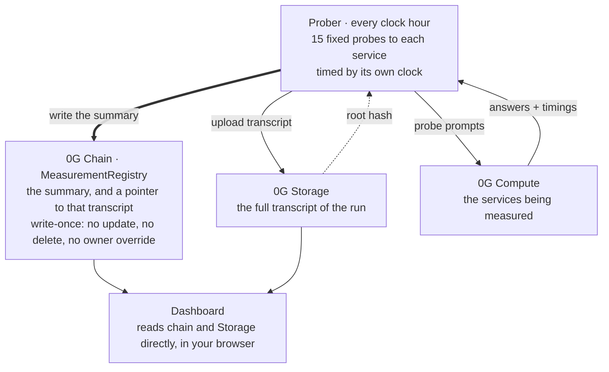

# 0G Provider Observatory

An independent measurement layer for 0G's inference network.

It measures providers from the outside, writes what it found to a write-once ledger on 0G
mainnet, and puts the raw transcript on 0G Storage — so anyone can recheck the numbers, or
take their own measurement and compare.

It reports divergence. It does not attribute motive.

---

## The problem

0G's network exposes dozens of inference services. Several providers serve the same model,
at different speeds, with different guarantees.

Today a developer picks between them using figures the network reports about itself. Nobody
has measured those figures independently, and none of them are kept over time — so there is
no way to ask "how did this provider behave last week", and no way to check whether two
providers claiming the same model actually answer alike.

This project measures that, and publishes the evidence alongside the result.

## How it works



Three numbers per service, per epoch:

| | |
|---|---|
| **p50 / p95** | response time, measured by the prober's own clock |
| **error rate** | calls that failed in a way attributed to the provider |
| **divergence** | how often this service's answers differed from other providers of the same model |

An **epoch** is one measurement run. One per clock hour.

### Live on 0G Aristotle mainnet — chain 16661

```
ProviderRegistry      0x25165feDACd1B78e103c3B49FcAF7CAeB118b9D6
MeasurementRegistry   0xF2fC195A72Ed74e09530b31C568c1e0CBF6c0333
prober                0x691Bb0Cc823A03f7dcaF272Dc62896668f81D2FD
```

38 provider/model pairs registered. Published so far:

| Epoch | Written (UTC) | Services | Calls | Transaction |
|---|---|---|---|---|
| 496539 | 2026-08-24 03:31 | 10 | 146 | [`0xf3f1de65…`](https://chainscan.0g.ai/tx/0xf3f1de65f0b25652ea0e88cde51d2cc3ee879e574609863b12b97fcb53ca83b2) |
| 496540 | 2026-08-24 04:10 | 10 | 145 | [`0xec8f6a1e…`](https://chainscan.0g.ai/tx/0xec8f6a1e456d3194b9476c7f8e04e3bfcb5f0c2750d19de6f0c8f7cb1e3676a1) |
| 496591 | 2026-08-26 07:18 | 10 | 149 | [`0x73d3f088…`](https://chainscan.0g.ai/tx/0x73d3f088264e408f582031cb22da523e1bfecdcc207c86d1d0205a4963f85d79) |
| 496592 | 2026-08-26 08:34 | 10 | 149 | [`0x0958e353…`](https://chainscan.0g.ai/tx/0x0958e353c1731dd295062bdd96c6ec5d8e3f18d720a6ac57be1d421522720208) |

`Calls` is the number of samples the published figures rest on, summed over the ten services
— the same `calls` field each on-chain measurement carries. Every epoch sent 150.
The prober's full history is `epochsOf(0x691Bb0Cc…)` on `MeasurementRegistry`; this table
is that list, not a selection from it.

## Check it yourself

Three checks, each doubting the one before it. Pick how far you want to go.

### 1. Does the number follow from the evidence?

```bash
pnpm install
pnpm verify 496540
```

No wallet, no API key, no cost. It reads the chain record, fetches the evidence its
`storageRoot` points at, rehashes the bytes, and recomputes every published figure using the
rules the bundle itself states.

`src/verify/` imports nothing from `src/probes/`. A verifier that called the measurement code
would agree with it even if the formula were wrong — it would catch tampering and nothing
else.

### 2. Does the instrument give the same answer twice?

```bash
pnpm reproduce data/epochs/<bundle>.json 496539
```

Also free. Two runs an hour apart see different load, so latency is reported as a **ratio and
never scored**. What is stable enough to compare is the conclusion: observed mode, whether
divergence was measurable, whether the service diverges at all, and error rate past 1000 bps.

Neither run is treated as correct. Where they disagree, the tool names the disagreement.

### 3. Do you get the same result?

Take your own measurement with your own Router key and compare it against a published epoch.
Two ways:

**From the dashboard**, on the Measure panel — pick a group, see the call count before you
spend anything, paste a key with `inference` scope. The probes come from the published
epoch's evidence, not from this repository. No clone, no flags. The cheapest group costs
about **$0.003**.

> **This path asks one thing of you.** Your key passes through a small server of ours at
> `/api/router` on its way to 0G's Router. It has to: the Router will not answer a browser
> page it does not recognise.
>
> That server forwards one call and nothing else. It holds no key of its own, never reads the
> chain, and does no measuring — so it cannot change a number. What it *can* do is see your
> key go past, which is why it logs no header and no body. It is 83 lines, and reading them is
> the point: [`api/router/chat/completions.ts`](api/router/chat/completions.ts).
>
> Why it has to exist, measured rather than assumed:
> [`docs/network-findings.md`](docs/network-findings.md#5-the-router-answers-a-browser-only-from-an-origin-it-already-knows).

**From a clone**, which skips that server entirely — the CLI calls 0G's Router directly and
nothing of ours is in the path:

```bash
# see what it would cost — nothing is sent without --confirm
pnpm epoch --no-lock --budget-usd=0.80 --exclude=

# your own run: needs ROUTER_API_KEY, writes nothing to the chain
pnpm epoch --confirm --no-lock --budget-usd=0.80 --exclude=

# compare it against a published epoch
pnpm reproduce data/epochs/<your-bundle>.json 496540
```

That measures all 10 multi-provider groups — 23 services, 345 calls, about **$0.78**. Drop
both flags to measure only the pinned series instead: 10 services, about **$0.055**.

> Flags must be written as `--flag=value`. Through `pnpm`, the space-separated form is
> swallowed before the script sees it.

## Run it locally

Everything below works from a cold clone. None of it needs a key or costs anything.

```bash
pnpm install

pnpm dry-run          # plan a whole epoch offline: roster, groups, cost, sample request
pnpm test             # TypeScript suite — 313 tests
pnpm contracts:test   # Solidity suite (needs Foundry)
pnpm typecheck
pnpm compare          # reconcile the Router's list against the on-chain registry
pnpm dashboard:dev    # the dashboard, reading mainnet
```

The Measure panel needs the relay, which only exists on a real deployment or under
`npx vercel dev` — not under `pnpm dashboard:dev`.

For a live prober run you also need a `.env`; copy `.env.example` and fill in `PRIVATE_KEY`
and `ROUTER_API_KEY`.

## What we do not know

**We cannot weight by traffic.** We do not know how real usage is distributed, so a slow
provider here may serve almost nobody.

**A single epoch's p95 is its slowest call.** At 15 probes it carries almost no tail
information. It becomes meaningful only once epochs are pooled.

**Divergence is a distance, never a verdict.** A provider that differs from its peers may be
running a different model, quantisation, sampler or system prompt. This measurement cannot
tell which.

**A dash is not a zero.** The noise floor comes from one byte-identical probe pair per epoch,
so within a single epoch it reads 0% or 100% and nothing between. Where it could not be
measured, divergence is withheld rather than published as zero.

**`standard` mode is not a fault.** Nobody can put a closed third-party API inside their own
TDX enclave. It is shown with its technical reason and is never scored down.

## Layout

| | |
|---|---|
| `contracts/` | Foundry. `MeasurementRegistry` is write-once — no update, no delete, no owner override |
| `src/probes/` | the 15-probe suite, provider pinning, roster fitting, divergence |
| `src/sources/` | the Router and the on-chain service registry, reconciled against each other |
| `src/chain/` | reading and writing the ledger |
| `src/storage/` | evidence bundles and 0G Storage upload |
| `src/verify/` | independent recomputation and cross-run comparison. Imports nothing from `src/probes/` |
| `src/relay/` | the relay's rules as pure functions: what it forwards, what it refuses |
| `src/scripts/` | every `pnpm` command in this README |
| `api/router/` | the relay itself — one call forwarded, no secret, no chain, no measurement |
| `dashboard/` | the public view |
| `docs/HANDOFF.md` | task board, measured findings, and what is still open |

Built for [0G Bridge by AKINDO](https://akindo.io), Wave 3.
