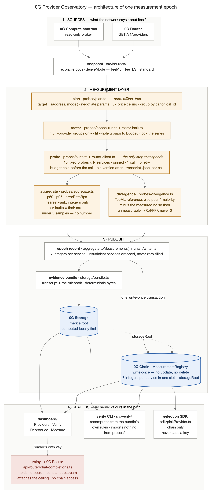

# Architecture — 0G Provider Observatory

One measurement epoch, end to end. Every box names the file that does the work.



Source: [`diagrams/architecture.mmd`](diagrams/architecture.mmd) · vector:
[`diagrams/architecture.svg`](diagrams/architecture.svg)

Re-render after editing the source:

```bash
cd docs/diagrams
npx -y @mermaid-js/mermaid-cli@11 -i architecture.mmd -o architecture.png -c mmdc.json -b white -w 2600 -s 2
npx -y @mermaid-js/mermaid-cli@11 -i architecture.mmd -o architecture.svg -c mmdc.json -b white
```

Full narrative: `docs/provider-observatory.md`. Task board: `docs/HANDOFF.md`.
