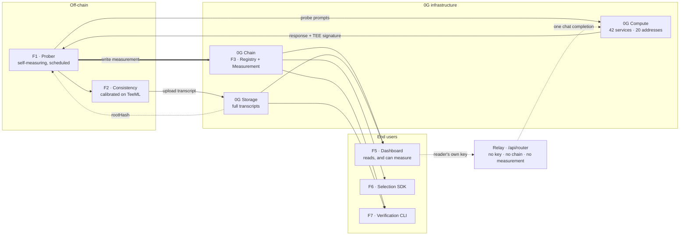
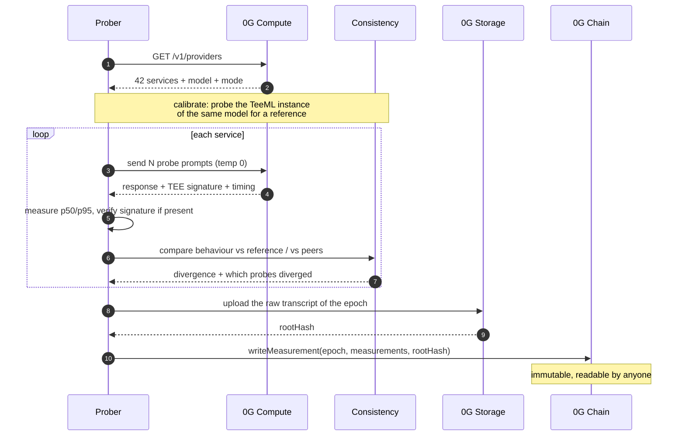

# 0G Provider Observatory

`0G Bridge · Wave 3` · `Developer Tooling` · `Draft v3.1`

An independent instrument for 0G's inference network. Today developers pick
providers based on metrics the network reports about itself — **nobody has
measured them independently, and nothing is retained over time**.

| | |
|---|---|
| **Deadline** | 2026-08-30 · 22:00 |
| **Build model** | Task-based |
| **0G components** | Chain · Storage · Compute |
| **Estimated cost** | $10 – $20 |

---

## 01 · The problem

The 0G Compute Router can route by *lowest latency* or *lowest price*. That is a
good feature. But the numbers behind that decision are reported by the network
itself, and nobody checks them.

On 2026-08-21 the Router reported four models of wildly different sizes —
`kimi-k2.7-code`, `glm-5.2`, `qwen3.7-max`, `qwen3.7-plus` — all with a latency
of **9408 ms**, identical to the millisecond. Those four records belong to the
same operator address, so the figure is most likely aggregated at the address
level rather than measured per model.

Nobody is doing anything wrong here. But a developer choosing the "fastest
provider" is deciding on a number that does not describe what they will actually
get. And if that number changes next week, there is no record to compare against
— **history does not exist**.

The second problem is quieter. Each provider runs in one of three very different
guarantee modes. That information *is* in the API but appears in *no* interface.
Users do not know which commitment they are buying.

This is not theoretical. Teams in Wave 3 described it themselves when listing
what they had to build by hand:

> 0G Compute calls can take 10–20 seconds. We added a job queue in the backend
> and return a pending status to the frontend.
>
> — VeriAgent · Wave 3

> Dispatch inference to 0G Compute TEE service (or fallback provider) and attach
> normalized TeeProof envelopes.
>
> — Aevum · Wave 3

> Zero-dependency verify script (stdlib only): PASS against live chain state.
>
> — TRAIDE Keeper · Wave 3

Four teams who do not know each other each rebuilt nearly the same piece of
infrastructure. That is the classic signature of something missing from the
stack.

---

## 02 · Mapping the network

Calling `router-api.0g.ai/v1/providers` on mainnet on 2026-08-21: **42 service
records** from **20 operator addresses**, belonging to **6 providers**. This is
the real state, not an inference from documentation.

| Operator | Records | Modes |
|---|---:|---|
| 0G Foundation | 16 | 4 TeeML · 12 standard |
| Aliyun (Alibaba Cloud) | 16 | TeeTLS |
| Tencent | 4 | TeeTLS |
| OpenRouter | 2 | TeeTLS |
| MiniMax | 2 | TeeTLS |
| ByteDance | 1 | TeeTLS |
| (undeclared) | 1 | TeeML |

Three modes, three different guarantees — and this is exactly what users never
see:

| Mode | Records | Share |
|---|---:|---:|
| TeeML | 5 | 11.9% |
| TeeTLS | 25 | 59.5% |
| standard | 12 | 28.6% |

| Mode | What you are guaranteed | What you are not |
|---|---|---|
| **TeeML** | The model runs inside a TDX enclave, verifier `dstack`. Which model ran is provable | — |
| **TeeTLS** | The broker is attested inside a TEE; the response genuinely came from that provider | No proof of *"model execution specifics"* |
| **standard** | No TEE fields at all | No cryptographic evidence at any layer |

> **Reading the number correctly**
>
> 15 of 20 operators do not run TeeML. That is **the size of the unmeasured
> surface**, not a count of suspicious providers. And it cannot be weighted by
> real traffic — the API does not expose that data.

### `standard` mode is sound architecture, not carelessness

All 12 `standard` records belong to the 0G Foundation, reselling Claude, GPT and
Kimi through upstream APIs. Nobody can put another vendor's closed API inside
their own TDX enclave. The ranking has to say so, or it penalises a correct
engineering decision.

### 42 records, but only 20 addresses

```
0x1F444c8A8D0b…  9 services   0G Foundation
0xB01EBd79c3fd…  6 services   Aliyun
0xe4d9768112BF…  4 services   Tencent
0xF203A388e9E7…  4 services   Aliyun
```

Ranking by "model" creates an illusion of diversity. The dashboard has to roll
up to the operator to reflect how concentrated the network actually is.

### A calibration pair already exists

```
glm-5.2
  provider A   TeeML    lat=3080 ms
  provider B   TeeTLS   lat=9408 ms

deepseek-v4-flash-0731   4 providers, same model
  price spread 45%       2930 ms -> 11149 ms
```

The same model exists in both a provable and a non-provable mode. TeeML becomes
the reference for calibrating the consistency measurement — no need to stand up
a decoy provider.

---

## 03 · Three questions the product answers

**01 · What is the real latency**
Measured by a third party, per provider, never pooled by address. With p50 and
p95, not a single number.

**02 · Which commitment are you buying**
TeeML, TeeTLS or standard — shown next to every provider, with an explanation of
what that mode does and does not guarantee.

**03 · How did it behave last week**
Per-epoch history, written immutably to 0G Chain. The one thing that does not
exist today at all.

Plus a fourth measurement: **consistency**. For a model served by several
providers — especially where a TeeML instance exists as a reference — does
response behaviour match. This is a *divergence measurement*, not a verdict.

---

## 04 · Seven features

The codes F1–F7 are identifiers for reference while building, not an order of
execution. The first three are the mandatory core; the other four make that core
usable.

### F1 · Prober

A scheduled service that sends a fixed probe suite to every provider and
**measures for itself** instead of trusting the Router's figures.

- read the list from /v1/providers
- measure p50 / p95 latency and error rate
- measure per model, never pooled by address
- verify the TEE signature where one exists

### F2 · Consistency measurement

Does response behaviour match across providers claiming the same model.
Calibrated on the `glm-5.2` TeeML/TeeTLS pair.

- deterministic prompts, temperature 0 where supported
- cross-compare providers serving one model
- TeeML as the reference where one exists
- report divergence, do not attribute cause

### F3 · On-chain measurement ledger

A contract on 0G mainnet storing the result of each epoch. Immutable, readable
by anyone, never through our server.

- ProviderRegistry — address, model, mode
- MeasurementRegistry — per-epoch measurements
- store only the summary plus a rootHash, to stay cheap
- designed open for multiple probers later

### F4 · Evidence store on Storage

Raw transcripts, responses and TEE proofs pushed to 0G Storage. On-chain keeps
only the pointer.

- the full transcript of every epoch
- rootHash embedded in the on-chain record
- keeps on-chain cost nearly constant

### F5 · Public dashboard

A provider comparison built on real measurements, rolled up to the operator,
labelled with the guarantee mode.

- self-measured latency, uptime, divergence
- roll 42 records up to 20 addresses
- TeeML / TeeTLS / standard labels with explanations
- every number links out to the explorer
- measure a group yourself, in the page, with your own key

### F6 · Provider selection SDK

A small TypeScript package for picking a provider by independent measurement and
by the guarantee level you want.

- pickProvider({ mode, maxP95 })
- reads straight from chain, never through our API
- used alongside the Router, not as a replacement

### F7 · Independent verification CLI

What turns the dashboard from "take our word for it" into "check it yourself".
Without it the whole project is just a web page with opinions.

- fetch the measurement record from chain
- fetch the transcript from Storage
- re-hash, compare, verify the TEE signature
- print PASS or FAIL

---

## 05 · Architecture



**Figure 1** — The prober is the only component that writes, and every published
number is read straight from 0G Chain and 0G Storage — nothing on the reading
path goes through us. The dotted path is the one exception, added when the
dashboard learned to measure: a reader who wants their own measurement sends
their own Router key through our relay, because the Router answers a browser only
from an origin on its allowlist and forbids the price-ceiling headers a browser
would need to send. The relay holds no key, reads no chain and runs no
measurement, so it cannot produce a number — but it is the one place the project
asks to be trusted, and the page says so above the input.

---

## 06 · The measurement epoch



**Figure 2** — Transcripts go to Storage *before* the chain write, so the
rootHash in a measurement always points at evidence that already exists.

---

## 07 · Three user flows

```mermaid
flowchart TB
  subgraph A["Flow A — a developer picking a provider"]
    direction LR
    A1["Call the SDK<br/>pickProvider(mode, maxP95)"] --> A2["Read MeasurementRegistry<br/>on 0G Chain"]
    A2 --> A3["Filter by real measurements<br/>and guarantee level"]
    A3 --> A4["Pin the provider<br/>when calling the Router"]
  end

  subgraph B["Flow B — anyone who wants to check for themselves"]
    direction LR
    B1["Run the CLI<br/>verify &lt;measurementId&gt;"] --> B2["Fetch the measurement<br/>from 0G Chain"]
    B2 --> B3["Fetch the transcript<br/>from 0G Storage"]
    B3 --> B4["Re-hash + verify<br/>the TEE signature"]
    B4 --> B5{"Match?"}
    B5 -->|"yes"| B6["PASS"]
    B5 -->|"no"| B7["FAIL"]
  end

  subgraph M["Flow C — measure it yourself, from the page"]
    direction LR
    M1["Pick a group<br/>in the dashboard"] --> M2["Replay the probes<br/>recorded in the evidence"]
    M2 --> M3["Aggregate + compare<br/>in the browser"]
    M3 --> M4["Where the two runs<br/>disagree"]
  end

  style B6 fill:#E4F0E8,stroke:#2C6E4E,color:#1E4C36
  style B7 fill:#F6E3E0,stroke:#9E3B2E,color:#7A2C22
```



**Figure 3** — Flow B is the argumentatively load-bearing part. If an outsider
cannot verify for themselves, the product is just a centralised leaderboard —
exactly the thing it sets out to replace. Flow B proves a published number
follows from its evidence; Flow C asks the harder question, whether the
instrument gives the same answer twice, and answers it with a fresh measurement
rather than with arithmetic on an old one. Flow C is the only one that costs the
reader anything, and the only one that needs a server of ours.

---

## 08 · Principles

**01 · An instrument, not an indictment**
Report divergence, do not rule on motive. One address selling many models is
normal behaviour for an aggregator.

**02 · Explain before ranking**
`standard` mode is shown with its technical reason, never scored down as a
defect.

**03 · Every number traces to a source**
No number exists only on the dashboard. All of them trace back to chain, Storage
and the raw transcript.

**04 · State plainly what we do not know**
We cannot weight by traffic. We do not know how real traffic is distributed. Say
so on the dashboard instead of glossing over it.

---

## 09 · Scope

| Item | Wave 3 | Note |
|---|---|---|
| F1 Prober, self-measured latency/uptime | Yes | Core. Measured per service, never pooled by address. |
| F2 Consistency, calibrated on glm-5.2 | Yes | 15 hand-written probes. TeeML as reference, peer comparison where none exists. |
| F3 Contract on 0G mainnet | Yes | Mandatory for Wave 3 eligibility. |
| F4 Transcripts to 0G Storage | Yes | Cheap, and it is the second 0G component. |
| F5 Dashboard | Yes | Rolled up by operator, mode labels with explanations. |
| F7 Verification CLI | Yes | Small but argumentatively central. Not cuttable. |
| F6 Provider selection SDK | If time | A few dozen lines; cuttable without breaking the story. |
| Standing up a decoy provider | Dropped | Unnecessary — the glm-5.2 TeeML/TeeTLS pair is a real control. |
| An "honesty" ranking | Dropped | Replaced by a divergence measurement. No moral labels on providers. |
| Full statistical methodology | No | Wave 4. Needs data accumulated over many epochs. |
| Multiple decentralised probers + staking | No | Wave 5. But the contract must be designed open for it now. |

---

## 10 · Risks

### Being read as an attack on the host — *closed*

The subjects of measurement include the 0G Foundation itself, Alibaba Cloud,
Tencent and ByteDance. The old positioning — "88% of the network cannot prove
which model ran" — would read as an accusation aimed at the organisers.

Repositioned to **independently measuring what nobody has measured**. Same
architecture, same code, a different claim. The principles in section 08 keep
the tone consistent.

### Nothing to catch — *closed*

The old plan was to stand up a decoy provider so the demo had drama.

No longer needed. The value is in the measurement, not in catching anyone. The
evidence already exists: 9408 ms shared across four models, and
`deepseek-v4-flash` spanning a 3.8x latency range across 4 providers of the same
model.

### Can a TEE signature be verified from outside — *closed*

Known: 30 of 42 records carry `tee_type=TDX`, `tee_verifier=dstack`,
`tee_attested=true`.

Answered: yes. Both `/v1/proxy/attestation/report` and
`/v1/proxy/signature/{chatID}` are public and need no auth, and signature
recovery runs offline via `ethers.recoverAddress()`. F7 keeps its strong scope.

### The relay is a trust surface the project did not have — *open*

Measuring from the page needs a server, because the Router answers a browser only
from an origin on its allowlist and its `access-control-allow-headers` omits the
price ceiling. So the reader's own API key transits `/api/router`, and section
05's original claim — that no component has to trust our server — no longer holds
for that one path.

Bounded rather than removed. The relay holds no key of its own and rejects a
request without one, its upstream is a constant so it cannot be aimed at another
host, it attaches the price ceiling itself so a caller cannot widen it, and it
logs no header and no body. It reads no chain and must never gain that: the
ledger is write-once and keyed by prober, and a second write path behind a public
endpoint would undo both. It is also not on the path of any published number — it
cannot produce a wrong measurement, only see a key in transit. What remains is
real and is stated on the page rather than buried: the rate limit is per
instance, not global, and a reader who does not want to trust it can still run
the same measurement from a clone.

### Overlap with VeriAgent — *open*

VeriAgent in Wave 3 also builds a "verification oracle" that calls 0G Compute to
check inference.

The subject is entirely different: they score the trustworthiness of a user's
*agent*; we measure the *infrastructure* of the network itself. This has to be
explicit in the one-line description and in the demo video.

### Mainnet gas and tokens — *open*

Wave 3 requires a contract on mainnet, and the faucet only issues testnet
tokens.

Buy roughly $10–20 of 0G up front, or ask for support in 0G's Telegram. Develop
entirely on testnet and deploy only the final build to mainnet.

---

## 11 · Order of work

There is no per-day schedule. Work is picked off a task board, and the only
fixed date is the submission deadline. What matters is the dependency order, not
the calendar.

| Task | State | Waits on |
|---|---|---|
| T1 Repo, dual-source reconciliation, `deriveMode()` | Done | — |
| T2 Probe suite, 15 deterministic probes | Done | — |
| T3 Provider-pinned Router layer | Done | — |
| T4 Epoch plan and offline dry run | Done | — |
| T5 Divergence engine · F2 | Ready | nothing |
| T6 Latency aggregation, p50 / p95 · F1 | Ready | nothing |
| T7 Registry contracts · F3 | Ready | nothing |
| T8 Verification CLI · F7 | Ready | nothing |
| T9 Dashboard · F5 | Ready | nothing |
| T10 Live epoch run against real providers | Blocked | Router API key · T5 · T6 |
| T11 Transcripts to 0G Storage · F4 | Blocked | T10 |
| T12 Mainnet deploy, accumulate real epochs | Blocked | mainnet funds · T7 · T10 |
| T13 README, video, submission | Blocked | T12 |

> **Critical path**
>
> mainnet funds → **T7** → **T12** → **T13**. Wave 3 is invalid without a
> contract on 0G mainnet and an explorer link showing real activity, so that
> chain is the whole schedule. Everything in the Ready group runs alongside it,
> in any order.

- Stand the contract up early and let epochs accumulate while the rest is built.
  Judges open the explorer to check for genuine on-chain activity, and activity
  takes wall-clock time to exist.
- Nothing in the Ready group blocks anything else in it — the five can be taken
  in whatever order suits.
- The verification CLI is small but argumentatively load-bearing. Without it the
  product is a centralised leaderboard, which is the thing it sets out to
  replace.

---

Design draft v3.1 · positioning: independent measurement · task-based build ·
2026-08-21
Network figures measured 2026-08-21 from `router-api.0g.ai/v1/providers` · 42
services · 20 addresses · 6 operators
0G Bridge by AKINDO · Wave 3 · deadline 2026-08-30 22:00
